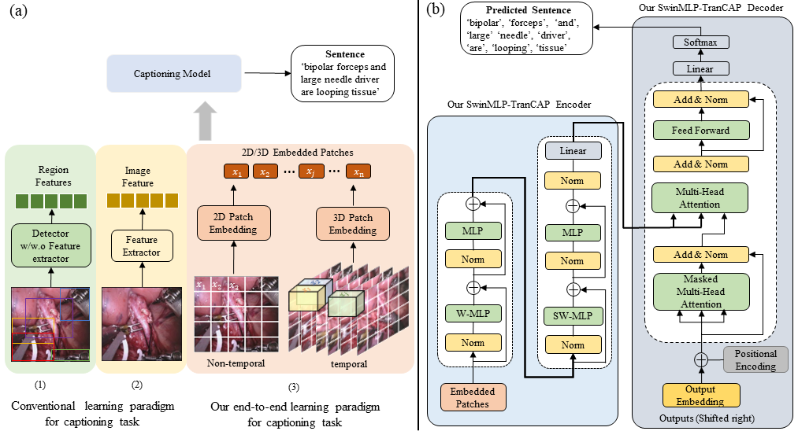
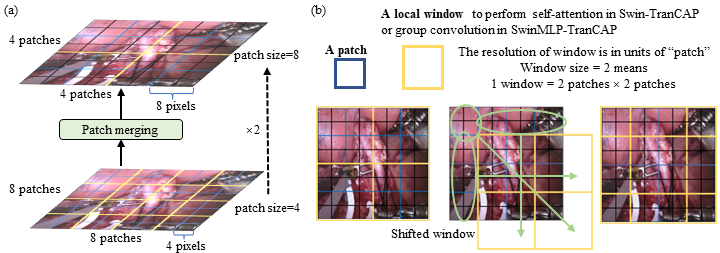
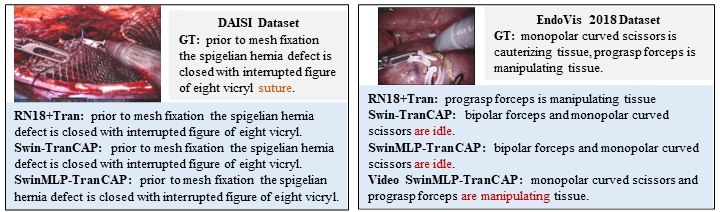

# SwinMLP-TranCAP: End-to-End Window-Based MLP Transformer Using Patches
This repository contains the reference code for the paper "Rethinking Surgical Captioning: End-to-End Window-Based MLP Transformer Using Patches (MICCAI2022)"

If you find this repo useful, please cite our paper.

<p align="center">
  
</p>

<p align="center">
  
</p>

<p align="center">
  
</p>

## Environment setup
- Python 3
- PyTorch 1.3+ (along with torchvision)
- cider (already been added as a submodule)
- coco-caption (already been added as a submodule) (**Remember to follow initialization steps in coco-caption/README.md**)
- yacs
- lmdbdict

If you have difficulty running the training scripts in `tools`. You can try installing this repo as a python package:

```
python -m pip install -e .
```

## Data preparation
- DAISI Dataset
Because we are not allowed to release the dataset, please require dataset access to the DAISI Dataset Creator.
[The AI-Medic: an artificial intelligent mentor for trauma surgery](https://www.tandfonline.com/doi/abs/10.1080/21681163.2020.1835548?journalCode=tciv20).
It is worth highlighting that we use the cleaned DAISI Dataset from the following work:
[Surgical Instruction Generation with Transformers](https://arxiv.org/pdf/2107.06964.pdf)

- EndooVision18 Dataset
Please download images from [endovissub2018-roboticscenesegmentation](https://endovissub2018-roboticscenesegmentation.grand-challenge.org/Data/)
Please download the caption annotation from the [CIDACaptioning](https://github.com/XuMengyaAmy/CIDACaptioning).


## Data preprocess
Please follow [ImageCaptioning/data/README](https://github.com/ruotianluo/ImageCaptioning.pytorch/blob/master/data/README.md) to implement the data preprocess.


## Training procedure
Our code is build on top of [ImageCaptioning](https://github.com/ruotianluo/ImageCaptioning.pytorch). 
We add our model (Swin_TranCAP, SwinMLP_TranCAP, Video_Swin_TranCAP, and Video_SwinMLP_TranCAP) into their captioning/models/, and also add the related dataloader file.

Our training config files can be found in configs folder.

Please run
```
$ python tools/train_vision_transformer.py --cfg configs/daisi/transformer/SwinMLP_TranCAP_L.yml --id daisi_SwinMLP_TranCAP
```

Similary, you can run other models by using our provided configs files.

## Acknowledgements
We thank the following repos providing helpful components/functions in our work.
[neuraltalk2](https://github.com/karpathy/neuraltalk2),
[ImageCaptioning](https://github.com/ruotianluo/ImageCaptioning.pytorch)
